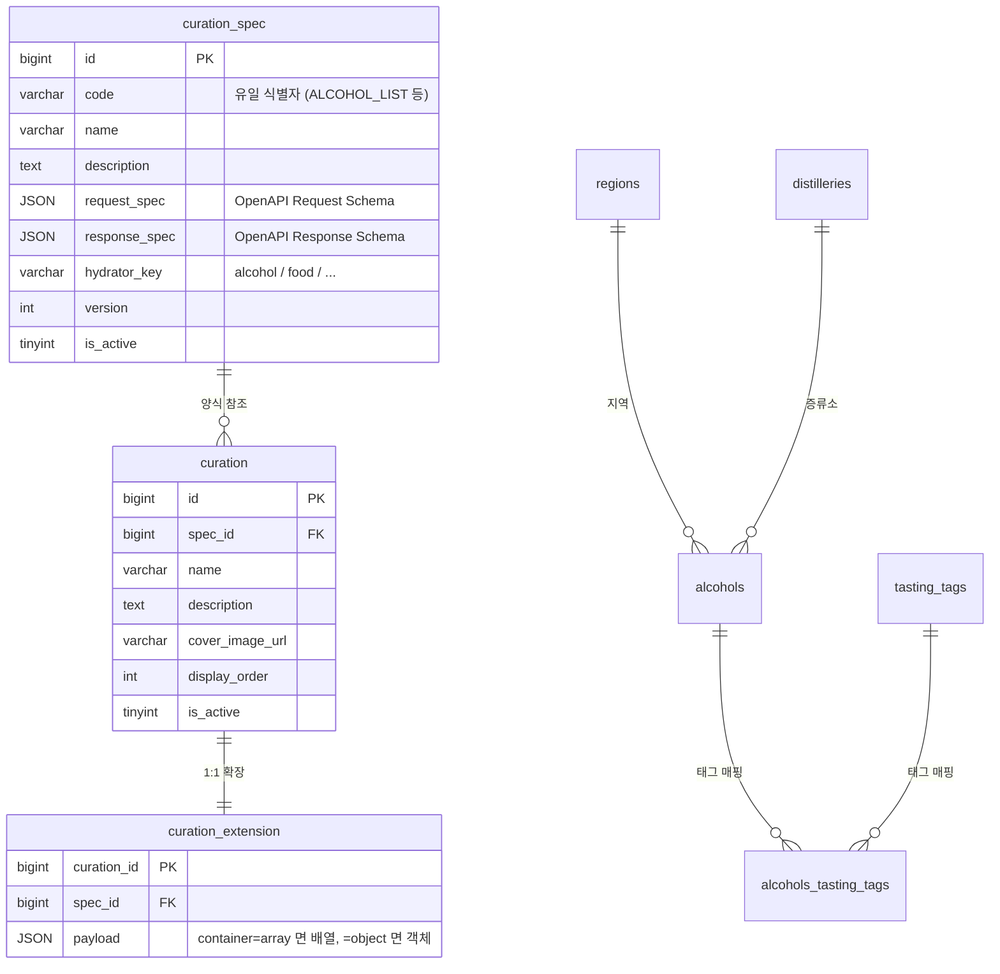
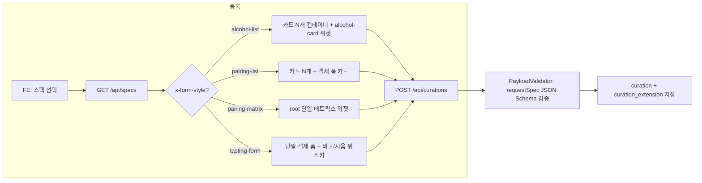
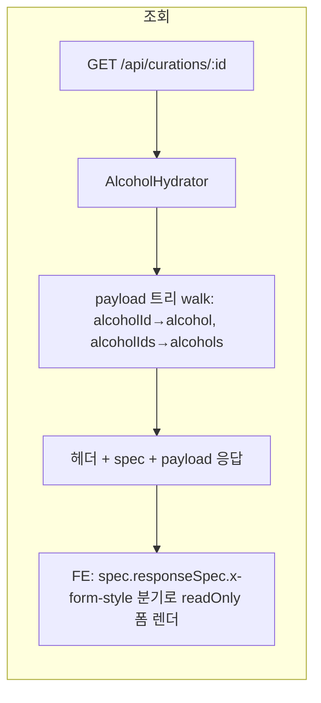

# Curation Demo

큐레이션 양식(스펙)을 OpenAPI 3.0 으로 정의하고, 그 스펙을 따르는 데이터를 등록·조회하는 데모.

- API 서버: Spring Boot 4.x + JPA (포트 **20081**)
- 정적 FE: 별도 정적 서버에서 `display/*.html` 서빙 (vanilla HTML/CSS/JS)
- DB: MySQL 8 (docker-compose)

---

## 1. 한 줄 컨셉

> **"스펙(양식)은 코드 자산. 데이터는 그 양식을 따르고, 응답은 hydrate된 형태로 내려간다."**

- 스펙은 `spec/*.json` 에 OpenAPI 3.0 문서로 정의 → DB `curation_spec` 적재
- 큐레이션 등록 = 스펙 선택 + payload 입력 (`POST /api/curations`)
- 서버는 `requestSpec` 으로 payload 를 JSON Schema 검증 후 저장
- 조회 시 payload 의 `alcoholId/alcoholIds` 자리는 **alcohol/alcohols 객체로 hydrate** 되어 응답
- 응답 최상위 = 헤더 + **`spec`** + **`payload`**

---

## 2. 스키마



---

## 3. 스펙 규칙 (`spec/*.json`)

### 3.1 파일 골격

```json
{
  "openapi": "3.0.3",
  "info":   { "title": "...", "description": "...", "version": "1.0.0" },
  "x-curation": {
    "code": "ALCOHOL_LIST",
    "hydratorKey": "alcohol",
    "container": "array"
  },
  "paths": {},
  "components": {
    "schemas": {
      "XxxRequest":  { "type": "object", "x-form-style": "...", "properties": {...} },
      "XxxResponse": { "type": "object", "x-form-style": "...", "properties": {...} }
    }
  }
}
```

### 3.1.1 모든 필드의 4가지 기본 키 (필수 원칙)

스펙(`spec/*.json`) 의 **모든 property** 는 다음 4개를 기본값으로 가져야 한다.

| 키 | 역할 | 예시 |
|---|---|---|
| `type` | JSON Schema 타입 | `"string"`, `"integer"`, `"number"`, `"boolean"`, `"object"`, `"array"` |
| `description` | 필드 설명 (한국어) | `"평균 별점 (소수점 2자리)"` |
| `example` | 샘플 값 (Swagger·툴 표시용) | `4.25`, `"라이터스 티얼즈"`, `[{...}]` |
| `x-field-style` | FE 위젯 패턴 키 | `"plain-text"`, `"alcohol-card"`, `"notes-list"` 등 |

> 적합한 위젯 패턴이 없으면 `"x-field-style": "none"` 으로 **명시적으로 표기**.
> 4개 중 하나라도 빠지면 PR 리뷰에서 fail.

### 3.1.2 hydrate 가 필요한 필드는 `x-graphql` 추가

서버는 응답 시 참조키(예: `alcoholId`, `alcoholIds`)를 실제 도메인 객체로 **hydrate** 한다.
이때 어떤 GraphQL Query 로 조회할지 **스펙 안에 인라인 메타**로 박아둔다 — 별도 매핑 테이블 없음, spec 자체가 source of truth.

#### 진입점 메타 (객체 형태) — 어디 한 곳에 박힘

| 키 | 의미 | 디폴트 |
|---|---|---|
| `query` | GraphQL Query 이름 | (필수) |
| `argName` | Query 인자 이름 | `id` |
| `argType` | 인자 GraphQL 타입 | `ID!` |
| `argFrom` | payload 안 인자 추출 path (JSON path) | `$` |
| `writeTo` | hydrate 결과를 박을 자식 키. null 이면 element 자체 머지 | null |
| `resultKey` | GraphQL 결과 객체의 매칭 PK | `alcoholId` |
| `payloadPath` | payload 안 sub-tree 위치 | `$` |

#### leaf 메타 — selection 포함 여부 + 인자

| 값 | 의미 |
|---|---|
| `true` | 키 그대로 GraphQL 필드로 selection 포함 |
| `"필드명"` (string) | 다른 GraphQL 필드명으로 매핑 |
| `{ "args": "limit: 10, sort: LATEST" }` | 자식 필드 페이지·정렬 인자 (그대로 GraphQL syntax) |
| `{ "field": "korName", "args": "..." }` | 이름 매핑 + 인자 |
| (생략) | selection 제외 (FE 표시 전용 필드) |

> **자식 컬렉션 페이지·정렬 컨벤션** — `Alcohol.picks/ratings/reviews` 가 받는 인자.
> `limit: Int = 10` (1~20, 초과 시 20 으로 캡), `sort: SortOrder = LATEST` (`LATEST` 최신순 / `POPULAR` 별점 높은 순).
> 스펙에서 `x-graphql.args` 한 줄로 박으면 빌더가 그대로 selection 에 박음.

#### 패턴 4종 — 실 spec 별

| spec | 패턴 | 진입점 메타 핵심 |
|---|---|---|
| `ALCOHOL_LIST` | array container, root joinKey 머지 | `argFrom: $.alcoholId` (writeTo 없음) |
| `PAIRING_LIST` | array container, nested writeTo | `argFrom: $.alcoholIds`, `writeTo: alcohols` |
| `PAIRING_MATRIX` | object container, root writeTo | `argFrom: $.alcoholIds`, `writeTo: alcohols` |
| `TASTING_V1` | object container, payloadPath nested | `payloadPath: $.alcohols`, `argFrom: $.alcoholId` |

> 4 패턴 모두 같은 빌더(`SpecGraphQlBuilder`) + 같은 머지(`CurationService.applyHydration`) 로 처리 — spec 안 메타 한 줄로 변형.

### 3.2 OpenAPI 확장 키 (스펙 ↔ FE Pattern Registry 약속)

| 키 | 위치 | 설명 |
|---|---|---|
| `x-curation.code` | spec root | 스펙 유일 식별자 |
| `x-curation.hydratorKey` | spec root | 응답 hydrate 도메인 (`alcohol` 등) |
| `x-curation.container` | spec root | `array` / `object` — payload 형태 |
| `x-form-style` | requestSpec/responseSpec root | FE 폼/뷰어 패턴 키 (`alcohol-list`, `pairing-list`, `pairing-matrix`, `tasting-form`) |
| `x-field-style` | property | FE 필드 위젯 패턴 키 (`alcohol-card`, `alcohol-card-list`, `alcohol-search-multi`, `notes-list`, `image-upload`, `long-text`) |
| `x-display-name` | property | 한글 라벨 (i18n 성격) |

> **스펙엔 키만, 디테일은 FE Pattern Registry 가 들고 있음.** 새 패턴 추가 = 스펙 키 1개 + `display/js/styles.js` 카탈로그 + (필요시) CSS.

### 3.3 등록된 스펙 3종

| code | container | x-form-style | 진입점 패턴 | 설명 |
|---|---|---|---|---|
| `RECOMMENDED_WHISKY` | array | `alcohol-list` | array container, root joinKey 머지 | 추천 위스키 카드 N개 |
| `WHISKY_PAIRING` | array | `pairing-list` | array container, nested writeTo | 음식/상황별 위스키 페어링 카드 N개 |
| `WHISKY_TASTING_EVENT` | object | `tasting-form` | object container, payloadPath nested | 시음회 1회차 |

---

## 4. 응답 형태

### 4.1 등록 (`POST /api/curations`)

```json
{
  "specId": 1,
  "name": "...",
  "description": "...",
  "displayOrder": 0,
  "isActive": true,
  "payload": [ { "alcoholId": 1, "comment": "..." }, ... ]   // 입력은 ID 형태
}
```

응답: `{ "id": 10 }` (또는 검증 실패 시 `400 + errors[]`).

### 4.2 목록 (`GET /api/curations`)

```json
[
  { "id": 10, "specCode": "ALCOHOL_LIST", "name": "가을 위스키", "displayOrder": 0, "isActive": true, ... }
]
```

### 4.3 상세 (`GET /api/curations/{id}`)

**최상위 = 헤더 + `spec` + `payload`** 구조.

```jsonc
{
  "id": 10,
  "name": "가을 위스키",
  "description": "...",
  "coverImageUrl": null,
  "displayOrder": 0,
  "isActive": true,
  "createAt": "...",

  "spec": {
    "id": 24,
    "code": "ALCOHOL_LIST",
    "name": "위스키 목록 추천",
    "container": "array",
    "responseSpec": { /* OpenAPI Schema (x-form-style/x-field-style 동봉) */ }
  },

  "payload": [
    {
      "alcohol": {                       // alcoholId 자리 → alcohol 객체로 hydrate
        "alcoholId": 1,
        "korName": "라이터스 티얼즈 레드 헤드",
        "engName": "Writers' Tears Red Head",
        "imageUrl": "...", "regionName": "아일랜드",
        "korCategory": "싱글 몰트", "cask": "Oloroso Sherry Butts",
        "abv": "46", "volume": "700ml",
        "tags": [ { "id": 58, "korName": "크리미", "engName": "creamy" }, ... ]
      },
      "comment": "진한 셰리"
    },
    ...
  ]
}
```

핵심:
- payload 에는 **alcoholId 가 직접 노출되지 않음** (alcohol 객체로 치환)
- `alcoholIds: [1, 5]` 자리는 `alcohols: [{...}, {...}]` 배열로 치환
- 별도 alcohols 매핑 필드 없음
- payload 안에 alcohol 외 다른 도메인 키도 자유롭게 — 큐레이션 종류에 따라

---

## 5. 등록 흐름 / 조회 흐름





---

## 6. 디렉토리 구조

```
curation_demo/
├── spec/                              스펙 카탈로그 (OpenAPI 3.0)
│   ├── recommended_whisky.json
│   ├── whisky_pairing.json
│   └── whisky_tasting_event.json
├── schema.sql                         전체 DB 스키마 (도메인 + 큐레이션)
├── schema.init.sql                    전체 초기 데이터 (마스터 + spec + 데모 시드)
├── docker-compose.yml                 mysql + redis
├── src/main/java/io/git/curation/demo/
│   ├── CurationDemoApplication.java
│   ├── controller/                    REST (Alcohol/Curation/Spec)
│   ├── domain/                        JPA 엔티티 (Curation/Alcohol/Pick/Rating/Review/User/Tag/...)
│   ├── repository/                    JpaRepository
│   ├── service/                       CurationService (등록 + 조회 파이프라인)
│   ├── graphql/
│   │   ├── SpecGraphQlBuilder.java    spec → query·variables 빌드 (x-graphql 메타 기반)
│   │   └── resolver/                  도메인별 GraphQL Resolver
│   │       ├── AlcoholResolver.java   Query.alcohol(s) + Alcohol 의 11개 필드
│   │       ├── PickResolver.java      Pick.createAt / Pick.user
│   │       ├── RatingResolver.java    Rating.* (EmbeddedId 분해 + user)
│   │       ├── ReviewResolver.java    Review.createAt / lastModifyAt / user
│   │       └── UserResolver.java      Query.user (User 필드는 자동 매핑)
│   └── global/                        도메인 외 공통
│       ├── config/                    WebConfig (CORS)
│       ├── converter/                 JsonNodeConverter (JPA JSON ↔ JsonNode)
│       ├── exception/                 PayloadValidationException + GlobalExceptionHandler
│       ├── init/                      SpecBootstrap (부트 시 spec/*.json 자동 sync)
│       ├── request/                   CurationCreateRequest
│       ├── response/                  CurationDetailResponse / ListItem / ...
│       └── validator/                 PayloadValidator (networknt JSON Schema)
└── display/                           정적 FE
    ├── index.html / specs.html / curation-new.html / curations.html / curation-detail.html
    ├── css/common.css
    └── js/
        ├── api.js / dom.js / nav.js
        ├── styles.js                  FORM_STYLES / FIELD_STYLES (layout + viewLayout)
        ├── curation-new.js / curation-detail.js / curations.js / specs.js
        └── widgets/
            ├── alcohol-search.js      검색 + 칩
            ├── alcohol-card.js        풍부 카드 (별점·찜·태그·picks·ratings·reviews)
            ├── alcohol-card-list.js   카드 N개 (각 카드 = alcohol-card + 코멘트)
            ├── card-list.js           DnD + 추가/삭제, readOnly 모드
            ├── notes-list.js          텍스트 N개 (max=4)
            └── pairing-matrix.js      위스키↔음식 N:N 매트릭스
```

---

## 7. 주요 API

| Method | Path | 용도 |
|---|---|---|
| GET  | `/api/specs` | 스펙 목록 |
| GET  | `/api/alcohols?limit=` | 알코올 마스터 페이지 |
| GET  | `/api/alcohols/search?q=&limit=` | 알코올 이름 부분일치 검색 |
| GET  | `/api/alcohols/{id}/detail` | 알코올 카드 hydrate (region + tags 포함) |
| POST | `/api/curations` | 큐레이션 등록 (requestSpec JSON Schema 검증) |
| GET  | `/api/curations` | 큐레이션 목록 |
| GET  | `/api/curations/{id}` | 큐레이션 상세 (헤더 + spec + GraphQL 로 hydrate 된 payload) |
| POST | `/graphql` | GraphQL 엔드포인트 |
| GET  | `/graphiql` | GraphiQL UI (개발용) |
| GET  | `/swagger-ui.html` | Swagger UI |

---

## 8. 셋업 & 실행

### 8.1 사전 준비 (한 번만)

```bash
# 1) MySQL
docker compose up -d mysql

# 2) 전체 스키마
docker exec -i mysql mysql -u bottle_note -pbottle_note_1234 \
  --default-character-set=utf8mb4 bottle_note < schema.sql

# 3) 전체 초기 데이터
docker exec -i mysql mysql -u bottle_note -pbottle_note_1234 \
  --default-character-set=utf8mb4 bottle_note < schema.init.sql
```

> `schema.sql` 은 모든 테이블 DDL, `schema.init.sql` 은 알코올 마스터 스냅샷·spec 3종·시연용 큐레이션/사용자/리뷰/찜/별점 데이터를 모두 포함한다.
> 새 노트북에서는 위 순서대로 두 파일만 적용하면 된다.

### 8.2 애플리케이션 실행

```bash
./gradlew bootRun
# → 기본 API 포트: 20081
```

`SpecBootstrap` 은 부트 시 `spec/*.json` 을 다시 sync 하므로, spec JSON 을 수정했다면 재기동으로 `curation_spec` 을 갱신할 수 있다.

### 8.3 정적 FE 서버

```bash
python3 -m http.server 25173 --directory display
# 또는 IntelliJ HTTP Server / VSCode Live Server
```

### 8.4 브라우저 진입점

- 홈:           http://localhost:25173/index.html
- 스펙 목록:     http://localhost:25173/specs.html
- 등록 폼:       http://localhost:25173/curation-new.html
- 큐레이션 목록:  http://localhost:25173/curations.html
- 큐레이션 상세:  http://localhost:25173/curation-detail.html?id=5  (id 는 시드 결과 참고)
- GraphiQL UI:   http://localhost:20081/graphiql

---

## 9. spec 변경 시

1. `spec/*.json` 수정 → 부트 재기동 한 번 → `SpecBootstrap` 이 `curation_spec` upsert
2. 초기 DB 전체를 다시 만들 때는 `schema.sql` → `schema.init.sql` 순서로 재적용

별도 SQL 재생성 스크립트 없음 — spec 자체가 source of truth 이고, 복제용 초기 상태는 `schema.init.sql` 에 고정한다.

---

## 10. GraphQL hydrate 파이프라인 (요약)

큐레이션 상세(`GET /api/curations/{id}`) 의 흐름:

```
1·2. SpecGraphQlBuilder.build(responseSpec, payload)
       └─ responseSpec walk → x-graphql 진입점 메타 발견
       └─ argFrom 으로 payload 에서 변수 추출 → (query, variables) 한 쌍
3.   ExecutionGraphQlService.execute(req)  (in-process, HTTP 안 탐)
       └─ 각 @SchemaMapping 이 selection 에 들어온 필드만 lazy 호출
4·5. data.{entryField} → 머지 (writeMode 자동 추론: array vs single)
       └─ payloadPath 따라 root 또는 sub-tree 자리에 결과 set
6.   CurationDetailResponse 로 래핑
```

도메인별 lazy fetcher → `graphql/resolver/` 5 클래스가 `@SchemaMapping(typeName, field)` 로 SDL 의 각 필드 채움. selection 에 안 들어오면 호출 자체 X — over-fetching 방지.
