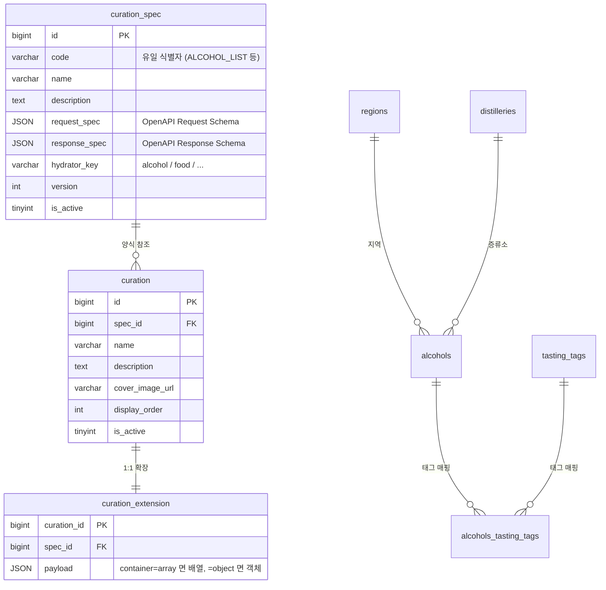
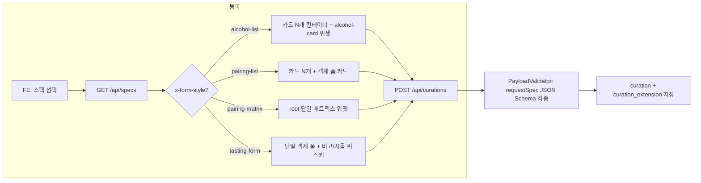
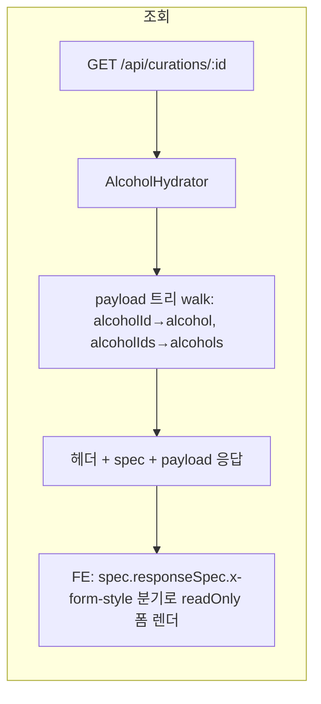

# Curation Demo

큐레이션 양식(스펙)을 OpenAPI 3.0 으로 정의하고, 그 스펙을 따르는 데이터를 등록·조회하는 데모.

- API 서버: Spring Boot 4.x + JPA (포트 **8081**)
- 정적 FE: 별도 정적 서버에서 `display/*.html` 서빙 (vanilla HTML/CSS/JS)
- DB: MySQL 8 (docker-compose)

---

## 1. 한 줄 컨셉

> **"스펙(양식)은 코드 자산. 데이터는 그 양식을 따르고, 응답은 hydrate된 형태로 내려간다."**

- 스펙은 `spec/*.json` 에 OpenAPI 3.0 문서로 정의 → DB `curation_spec` 적재
- 큐레이션 등록 = 스펙 선택 + payload 입력 (`POST /api/curations`)
- 서버는 `requestSpec` 으로 payload 를 JSON Schema 검증 후 저장
- 조회 시 payload 의 `alcoholId/alcoholIds` 자리는 **alcohol/alcohols 객체로 hydrate** 되어 응답
- 응답 최상위 = 헤더 + **`spec`** + **`payload`**

---

## 2. 스키마



---

## 3. 스펙 규칙 (`spec/*.json`)

### 3.1 파일 골격

```json
{
  "openapi": "3.0.3",
  "info":   { "title": "...", "description": "...", "version": "1.0.0" },
  "x-curation": {
    "code": "ALCOHOL_LIST",
    "hydratorKey": "alcohol",
    "container": "array"
  },
  "paths": {},
  "components": {
    "schemas": {
      "XxxRequest":  { "type": "object", "x-form-style": "...", "properties": {...} },
      "XxxResponse": { "type": "object", "x-form-style": "...", "properties": {...} }
    }
  }
}
```

### 3.2 OpenAPI 확장 키 (스펙 ↔ FE Pattern Registry 약속)

| 키 | 위치 | 설명 |
|---|---|---|
| `x-curation.code` | spec root | 스펙 유일 식별자 |
| `x-curation.hydratorKey` | spec root | 응답 hydrate 도메인 (`alcohol` 등) |
| `x-curation.container` | spec root | `array` / `object` — payload 형태 |
| `x-form-style` | requestSpec/responseSpec root | FE 폼/뷰어 패턴 키 (`alcohol-list`, `pairing-list`, `pairing-matrix`, `tasting-form`) |
| `x-field-style` | property | FE 필드 위젯 패턴 키 (`alcohol-card`, `alcohol-card-list`, `alcohol-search-multi`, `notes-list`, `image-upload`, `long-text`) |
| `x-display-name` | property | 한글 라벨 (i18n 성격) |

> **스펙엔 키만, 디테일은 FE Pattern Registry 가 들고 있음.** 새 패턴 추가 = 스펙 키 1개 + `display/js/styles.js` 카탈로그 + (필요시) CSS.

### 3.3 등록된 스펙 4종

| code | container | x-form-style | 설명 |
|---|---|---|---|
| `ALCOHOL_LIST` | array | `alcohol-list` | 위스키 카드 N개 (각 카드 = 위스키 1 + 코멘트). 풍부 알코올 카드 |
| `PAIRING_LIST` | array | `pairing-list` | 페어링 카드 N개 (음식 1 + 위스키 N + 페어링 노트) |
| `PAIRING_MATRIX` | object | `pairing-matrix` | 위스키 ↔ 음식 N:N 자유 연결 매트릭스. root 단일 위젯 |
| `TASTING_V1` | object | `tasting-form` | 시음회 1회차 (일시·장소·참가비·정원·시음 위스키 + 섹션별 비고) |

---

## 4. 응답 형태

### 4.1 등록 (`POST /api/curations`)

```json
{
  "specId": 1,
  "name": "...",
  "description": "...",
  "displayOrder": 0,
  "isActive": true,
  "payload": [ { "alcoholId": 1, "comment": "..." }, ... ]   // 입력은 ID 형태
}
```

응답: `{ "id": 10 }` (또는 검증 실패 시 `400 + errors[]`).

### 4.2 목록 (`GET /api/curations`)

```json
[
  { "id": 10, "specCode": "ALCOHOL_LIST", "name": "가을 위스키", "displayOrder": 0, "isActive": true, ... }
]
```

### 4.3 상세 (`GET /api/curations/{id}`)

**최상위 = 헤더 + `spec` + `payload`** 구조.

```jsonc
{
  "id": 10,
  "name": "가을 위스키",
  "description": "...",
  "coverImageUrl": null,
  "displayOrder": 0,
  "isActive": true,
  "createAt": "...",

  "spec": {
    "id": 24,
    "code": "ALCOHOL_LIST",
    "name": "위스키 목록 추천",
    "container": "array",
    "responseSpec": { /* OpenAPI Schema (x-form-style/x-field-style 동봉) */ }
  },

  "payload": [
    {
      "alcohol": {                       // alcoholId 자리 → alcohol 객체로 hydrate
        "alcoholId": 1,
        "korName": "라이터스 티얼즈 레드 헤드",
        "engName": "Writers' Tears Red Head",
        "imageUrl": "...", "regionName": "아일랜드",
        "korCategory": "싱글 몰트", "cask": "Oloroso Sherry Butts",
        "abv": "46", "volume": "700ml",
        "tags": [ { "id": 58, "korName": "크리미", "engName": "creamy" }, ... ]
      },
      "comment": "진한 셰리"
    },
    ...
  ]
}
```

핵심:
- payload 에는 **alcoholId 가 직접 노출되지 않음** (alcohol 객체로 치환)
- `alcoholIds: [1, 5]` 자리는 `alcohols: [{...}, {...}]` 배열로 치환
- 별도 alcohols 매핑 필드 없음
- payload 안에 alcohol 외 다른 도메인 키도 자유롭게 — 큐레이션 종류에 따라

---

## 5. 등록 흐름 / 조회 흐름





---

## 6. 디렉토리 구조

```
curation_demo/
├── spec/                              스펙 카탈로그 (OpenAPI 3.0)
│   ├── alcohol_list.json
│   ├── pairing_list.json
│   ├── pairing_matrix.json
│   └── tasting_v1.json
├── schema.sql                         curation_spec / curation / curation_extension DDL
├── seed-curation.sql                  스펙 4종 + 샘플 큐레이션 4건 시드 (자동 생성)
├── dev-snapshot.sql                   알코올 도메인 마스터 (alcohols/regions/distilleries/tasting_tags/매핑) — gitignored
├── docker-compose.yml                 mysql + redis
├── src/main/java/io/git/curation/demo/
│   ├── domain/                        Curation, CurationExtension, CurationSpec, Alcohol, Region, TastingTag
│   ├── repository/                    JpaRepository
│   ├── controller/                    SpecController, AlcoholController, CurationController
│   ├── service/                       CurationService (트랜잭션 + 검증 + 저장 + hydrate)
│   ├── validator/                     PayloadValidator (networknt JSON Schema)
│   ├── hydrator/                      AlcoholHydrator (payload walk + alcoholId → alcohol 치환)
│   ├── exception/                     PayloadValidationException + GlobalExceptionHandler
│   ├── request/                       CurationCreateRequest
│   ├── response/                      CurationDetailResponse(SpecMeta), CurationListItem, ...
│   ├── converter/                     JsonNodeConverter (JPA JSON ↔ JsonNode)
│   └── config/                        WebConfig (CORS)
└── display/                           정적 FE
    ├── index.html                     홈 (메뉴)
    ├── specs.html                     스펙 목록
    ├── curation-new.html              등록 폼 (동적)
    ├── curations.html                 큐레이션 목록
    ├── curation-detail.html           큐레이션 상세 (readOnly viewer)
    ├── css/common.css
    └── js/
        ├── api.js                     fetch 래퍼
        ├── dom.js                     안전한 DOM 빌더 (textContent 기반)
        ├── nav.js                     nav 활성 표시
        ├── styles.js                  FORM_STYLES / FIELD_STYLES — Pattern Registry
        ├── curation-new.js            x-form-style 분기 + WIDGET_FACTORY lookup
        ├── curation-detail.js         readOnly viewer (Pattern Registry 재사용)
        ├── curations.js               목록 카드 그리드
        ├── specs.js                   스펙 목록
        └── widgets/
            ├── alcohol-search.js      검색 + 칩 (single/multi)
            ├── alcohol-card.js        검색 → detail hydrate 풍부 카드
            ├── alcohol-card-list.js   카드 N개 (각 카드 = alcohol-card + 코멘트)
            ├── card-list.js           카드 N개 컨테이너 (DnD + 추가 + 삭제, readOnly 모드)
            ├── notes-list.js          텍스트 N개 동적 (max=4)
            └── pairing-matrix.js      위스키↔음식 N:N 매트릭스
```

---

## 7. 주요 API

| Method | Path | 용도 |
|---|---|---|
| GET  | `/api/specs` | 스펙 목록 |
| GET  | `/api/alcohols?limit=` | 알코올 마스터 페이지 |
| GET  | `/api/alcohols/search?q=&limit=` | 알코올 이름 부분일치 검색 |
| GET  | `/api/alcohols/{id}/detail` | 알코올 카드 hydrate (region + tags 포함) |
| POST | `/api/curations` | 큐레이션 등록 (requestSpec JSON Schema 검증) |
| GET  | `/api/curations` | 큐레이션 목록 |
| GET  | `/api/curations/{id}` | 큐레이션 상세 (헤더 + spec + hydrated payload) |
| GET  | `/swagger-ui.html` | Swagger UI |

---

## 8. 셋업 & 실행

### 8.1 사전 준비

```bash
# 1) MySQL 컨테이너
docker compose up -d mysql

# 2) 알코올 도메인 + 매핑 시드 (회사 비공개라 .gitignore — 별도 발급 필요)
docker exec -i mysql mysql -u bottle_note -pbottle_note_1234 \
  --default-character-set=utf8mb4 bottle_note < dev-snapshot.sql

# 3) 큐레이션 테이블
docker exec -i mysql mysql -u bottle_note -pbottle_note_1234 \
  --default-character-set=utf8mb4 bottle_note < schema.sql

# 4) 스펙 4종 + 샘플 큐레이션 4건 (한 번에)
docker exec -i mysql mysql -u bottle_note -pbottle_note_1234 \
  --default-character-set=utf8mb4 bottle_note < seed-curation.sql
```

### 8.2 실행

```bash
# API 서버 (8081)
./gradlew bootRun

# 정적 FE (예: 5173)
python3 -m http.server 5173 --directory display
# 또는 IntelliJ HTTP Server / VSCode Live Server
```

### 8.3 브라우저

- 홈:        http://localhost:5173/index.html
- 스펙 목록:  http://localhost:5173/specs.html
- 큐레이션 등록: http://localhost:5173/curation-new.html
- 큐레이션 목록: http://localhost:5173/curations.html
- 큐레이션 상세: http://localhost:5173/curation-detail.html?id=10

---

## 9. seed-curation.sql 재생성 (스펙 변경 시)

`spec/*.json` 을 수정했으면 다음 한 줄로 SQL 재생성:

```bash
python3 - <<'PY' > seed-curation.sql
# (프로젝트의 seed 생성 스크립트 — 사용자 정의)
PY
```

또는 README §8.1 의 기존 seed-curation.sql 그대로 import 해도 OK (수동 직접 갱신).
