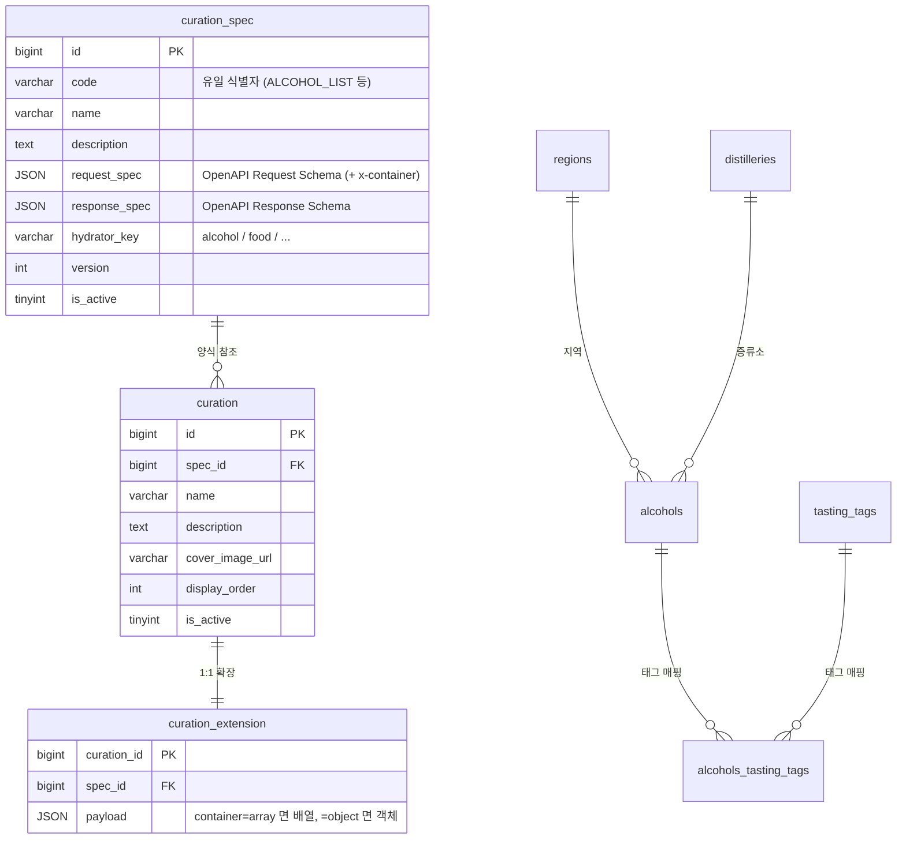
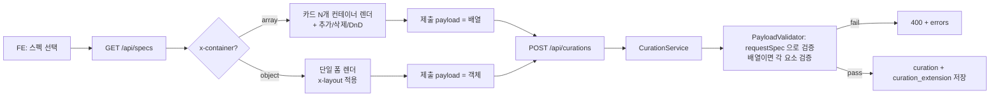
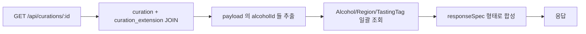

# Curation Demo

큐레이션 양식(스펙)을 OpenAPI 3.0 으로 정의하고, 그 스펙을 따르는 데이터를 등록·조회하는 데모.

- API 서버: Spring Boot 4.x + JPA (포트 **8081**)
- 정적 FE: 별도 정적 서버에서 `display/*.html` 서빙 (vanilla HTML/CSS/JS)
- DB: MySQL 8 (docker-compose)

---

## 1. 핵심 컨셉

> **"스펙 = 양식. 스펙은 코드 자산으로 관리하고, 데이터는 그 양식을 따라 저장한다."**

- 스펙은 `spec/*.json` 에 OpenAPI 3.0 문서로 정의 → DB 의 `curation_spec` 에 적재
- 큐레이션 등록 = 스펙을 골라 그 양식에 맞는 payload 입력
- 서버는 `requestSpec` 으로 payload 를 JSON Schema 검증 (`networknt/json-schema-validator`)
- 응답은 `responseSpec` 형태로 hydrate (alcohol 마스터·region·tags 등)
- payload 자체는 참조키 + 표시 정책 + 큐레이터 코멘트만 저장. **마스터 데이터는 박제하지 않는다.**

---

## 2. 스키마



| 테이블 | 역할 |
|---|---|
| `curation_spec` | 양식 카탈로그. OpenAPI 3.0 (Request/Response Schema) 두 개를 컬럼으로 |
| `curation` | 큐레이션 본체. 헤더(이름·커버 등) + spec_id |
| `curation_extension` | 1:1 확장. 스펙 양식대로 받은 payload JSON. array/object 둘 다 가능 |
| `alcohols` / `regions` / `distilleries` / `tasting_tags` / `alcohols_tasting_tags` | 알코올 도메인 마스터. 응답 hydrate 의 단일 진실 공급원 |

---

## 3. 스펙 규칙 (`spec/*.json`)

각 파일은 **하나의 큐레이션 양식 = OpenAPI 3.0 문서 1개**.

### 3.1 파일 골격

```json
{
  "openapi": "3.0.3",
  "info": { "title": "...", "description": "...", "version": "1.0.0" },
  "x-curation": {
    "code": "ALCOHOL_LIST",
    "hydratorKey": "alcohol",
    "container": "array"
  },
  "paths": {},
  "components": {
    "schemas": {
      "XxxRequest":  { "type": "object", "properties": {...}, "required": [...] },
      "XxxResponse": { "type": "object", "properties": {...}, "required": [...] }
    }
  }
}
```

규칙:

| 규칙 | 내용 |
|---|---|
| `components.schemas` 는 **정확히 2개** | `~Request` / `~Response`. 보조 객체는 인라인으로 풀 것 |
| `x-curation.code` | 시스템 내 유일 식별자 (UPPER_SNAKE) |
| `x-curation.container` | `array` 또는 `object`. 큐레이션 본문이 카드 N개냐 단일이냐 |
| `x-curation.hydratorKey` | 응답 hydrate 담당 도메인 (`alcohol` 등) |

### 3.2 OpenAPI 확장 키 (FE 힌트)

| 키 | 위치 | 값 | 효과 |
|---|---|---|---|
| `x-display-name` | 필드 | 한글 라벨 | 폼 라벨 / 카드 라벨 |
| `x-widget` | 필드 | `alcohol-search` / `alcohol-card` | FE 위젯 카탈로그에서 컴포넌트 매핑 |
| `x-widget-mode` | 필드 | `single` / `multi` | 단일/다중 선택 |
| `x-layout` | 스키마 root | `{ groups: [{title, rows: [[...]]}] }` | 폼 섹션·행 배치. 한 row 의 필드 N개 → 자동 N등분 grid |
| `x-card-style` | 스키마 root | `alcohol-rich` 등 | 카드 표현 모드 |

### 3.3 위젯 카탈로그 (FE)

| 위젯 | 입력 → 저장 | 표현 |
|---|---|---|
| `alcohol-search` (single/multi) | alcohol 검색 → ID 1개 또는 ID 배열 | 칩 |
| `alcohol-card` | alcohol 검색 → ID 1개 + 코멘트 | 마스터 정보 풍부 카드 (이름·국가·카테고리·캐스크·도수·태그) |

스펙에 없는 새 위젯이 필요하면 FE 측에 컴포넌트 추가 + `WIDGET_CATALOG` 등록 + 스펙에 `x-widget` 박기.

---

## 4. 등록·조회 흐름

### 4.1 등록 (`POST /api/curations`)



### 4.2 조회 (hydrate)



핵심: **payload 에는 ID 만 박혀있고**, 이름·평점·카테고리·태그 등은 **조회 시점에 도메인 마스터에서 hydrate**.

### 4.3 데이터 정책

- payload = 참조키(`alcoholId`) + 표시 정책(`display*`) + 큐레이션 고유 텍스트(`comment`, `description`)
- **마스터 데이터(이름·평점·태그 등) 는 저장하지 않음** — 단일 진실 공급원은 alcohol 도메인
- 위스키 마스터 변경 시 큐레이션도 자동 반영

---

## 5. 등록된 스펙 4종

| code | container | 설명 |
|---|---|---|
| `ALCOHOL_LIST` | array | 위스키 카드 N개 (각 카드: 알코올 1개 + 큐레이터 코멘트). hydrate: 이름·국가·카테고리·캐스크·도수·태그 |
| `PAIRING_LIST` | array | 페어링 카드 N개 (각 카드: 음식 1 + 위스키 N + 페어링 노트) |
| `PAIRING_MATRIX` | object | 위스키 ↔ 음식 N:N 자유 연결 매트릭스 |
| `TASTING_V1` | object | 시음회 1회차 (일시·장소·참가비·정원·시음 위스키 N) |

---

## 6. 디렉토리 구조

```
curation_demo/
├── spec/                              스펙 카탈로그 (OpenAPI 3.0)
│   ├── alcohol_list.json
│   ├── pairing_list.json
│   ├── pairing_matrix.json
│   └── tasting_v1.json
├── schema.sql                         curation_spec / curation / curation_extension DDL
├── dev-snapshot.sql                   알코올 도메인 마스터 50건 + 태그 + 매핑
├── docker-compose.yml                 mysql + redis
├── src/main/java/io/git/curation/demo/
│   ├── domain/                        Curation, CurationExtension, CurationSpec, Alcohol, Region, TastingTag
│   ├── repository/                    JpaRepository 구현
│   ├── controller/                    SpecController, AlcoholController, CurationController
│   ├── service/                       CurationService (트랜잭션 + 검증 + 저장)
│   ├── validator/                     PayloadValidator (networknt)
│   ├── exception/                     PayloadValidationException + GlobalExceptionHandler
│   ├── request/                       CurationCreateRequest
│   ├── response/                      CurationSpecResponse, CurationCreateResponse, AlcoholDetailResponse, ErrorResponse
│   ├── converter/                     JsonNodeConverter (JSON ↔ JsonNode)
│   └── config/                        WebConfig (CORS)
└── display/                           정적 FE (별도 서버)
    ├── index.html                     홈 (메뉴)
    ├── specs.html                     스펙 목록
    ├── curation-new.html              등록 폼
    ├── curations.html                 큐레이션 목록 (TODO)
    ├── curation-detail.html           큐레이션 상세 (TODO)
    ├── css/common.css
    └── js/
        ├── api.js                     fetch 래퍼
        ├── dom.js                     안전한 DOM 빌더 (textContent 기반)
        ├── nav.js                     nav 활성 표시
        ├── curation-new.js            x-container 분기 + 동적 폼 + 위젯 카탈로그
        └── widgets/
            ├── alcohol-search.js      검색 + 칩 (single/multi)
            ├── alcohol-card.js        검색 → detail hydrate 풍부 카드
            └── card-list.js           카드 N개 컨테이너 (DnD + 추가 + 삭제)
```

---

## 7. 주요 API

| Method | Path | 용도 |
|---|---|---|
| GET  | `/api/specs` | 스펙 목록 (hidden 포함) |
| GET  | `/api/alcohols?limit=` | 알코올 마스터 페이지 |
| GET  | `/api/alcohols/search?q=&limit=` | 알코올 이름 부분일치 검색 |
| GET  | `/api/alcohols/{id}/detail` | 알코올 카드 hydrate (region + tags 포함) |
| POST | `/api/curations` | 큐레이션 등록 (`requestSpec` JSON Schema 검증 후 저장) |
| GET  | `/swagger-ui.html` | Swagger UI |

---

## 8. 실행

```bash
# 1. MySQL 컨테이너
docker compose up -d mysql

# 2. 알코올 도메인 + 매핑 시드
docker exec -i mysql mysql -u bottle_note -pbottle_note_1234 \
  --default-character-set=utf8mb4 bottle_note < dev-snapshot.sql

# 3. 큐레이션 테이블 + 스펙 적재 (script 는 README 외 별도 안내 참고)
docker exec -i mysql mysql -u bottle_note -pbottle_note_1234 \
  --default-character-set=utf8mb4 bottle_note < schema.sql

# 4. API 서버 (8081)
./gradlew bootRun

# 5. 정적 FE (예: 5173 — IDE 또는 python http.server)
python3 -m http.server 5173 --directory display
# 또는 IntelliJ HTTP Server / VSCode Live Server
```

브라우저: http://localhost:5173/index.html
