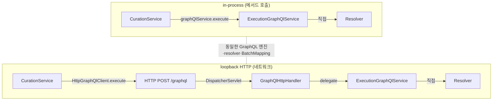
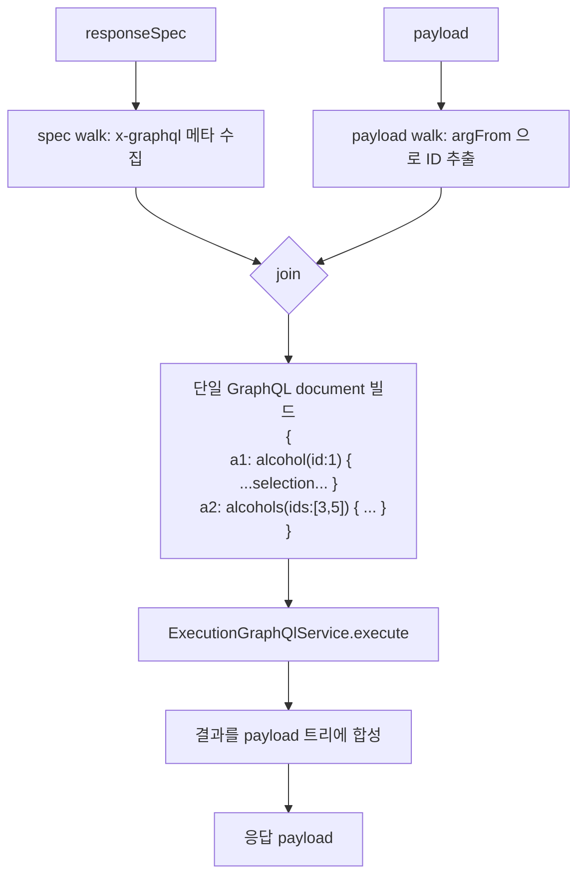

# GraphQL 도입 아키텍처

> 큐레이션 spec 의 hydrate 처리를 **선언적·자동화** 시키기 위해 spring-graphql 도입.
> 현재는 PoC 단계 (동작 체크). 다음 단계에서 큐레이션 spec 통합.

---

## 1. 왜 GraphQL?

기존 `AlcoholHydrator` 는 자바 코드에서 `alcoholId` / `alcoholIds` 키를 하드코딩으로 walk · 치환했다.

문제:
- 도메인 추가 = Hydrator 클래스 추가 (food·user·event…)
- spec 만 봐선 "이 필드가 어디서 오는지" 안 보임 (코드 까야 함)
- 같은 도메인이라도 응답 형태별로 (light/full) 분리 불가

해결 방향 — **GraphQL 패턴**:
- 도메인을 GraphQL 타입(SDL)으로 1번 정의
- 도메인별 resolver 1번 작성 (`@QueryMapping`/`@SchemaMapping`/`@BatchMapping`)
- 그 후엔 spec 메타에 "어떤 필드를 어떤 selection 으로" 만 박으면 자동 합성

---

## 2. SDL — 타입 시스템

`src/main/resources/graphql/schema.graphqls` 가 **타입의 진실 공급원**.

```graphql
type Alcohol {
  alcoholId: ID!         # ! = non-null
  korName: String!
  engName: String        # nullable
  cask: String
  abv: String
  volume: String
}

type Query {
  alcohol(id: ID!): Alcohol
  alcohols(ids: [ID!]!): [Alcohol!]!
}
```

| 표기 | 의미 |
|---|---|
| `String`, `Int`, `Float`, `Boolean`, `ID` | 기본 스칼라 |
| `!` | non-null |
| `[T!]!` | 배열도 non-null + 요소도 non-null |
| `type Query { ... }` | 클라이언트 진입점 |

Spring 이 SDL 보고 자동 처리:
- 응답 직렬화 시 SDL 필드 형태로 출력
- 잘못된 query → schema 검증 단계에서 reject

---

## 3. 서버 구조

```mermaid
flowchart LR
    subgraph Spring["Spring App (단일 JVM)"]
      direction TB
      EP1["GET /api/curations/{id}<br/>(REST)"]
      EP2["POST /graphql<br/>(GraphQL HTTP)"]
      EP3["GET /graphiql<br/>(개발용 UI)"]

      subgraph Engine["GraphQL 엔진"]
        SDL[schema.graphqls<br/>SDL 로드]
        EXEC[ExecutionGraphQlService]
      end

      subgraph Resolvers["Resolver (서비스 레이어)"]
        Q[AlcoholGraphController<br/>@QueryMapping<br/>@SchemaMapping]
      end

      Repo[AlcoholRepository<br/>RegionRepository<br/>TastingTagRepository]
      DB[(MySQL)]

      EP1 --> CSvc[CurationService]
      CSvc -.in-process.-> EXEC
      EP2 --> EXEC
      EP3 --> EP2
      EXEC --> Q
      Q --> Repo --> DB
    end
```

핵심:
- `/graphql` 은 자동 노출되는 **표준 GraphQL HTTP endpoint**
- `/graphiql` 은 브라우저 UI (학습·디버깅용)
- 서비스 레이어 (`CurationService`) 는 `ExecutionGraphQlService` 를 **직접 메서드 호출** (in-process)

---

## 4. in-process vs HTTP — 같은 엔진, 다른 transport



| | in-process | loopback HTTP |
|---|---|---|
| Transport | 메서드 호출 | HTTP POST |
| 직렬화 | X | JSON 두 번 |
| 트랜잭션 | 같이 묶임 | 끊어짐 |
| 학습 가치 | resolver/SDL/BatchMapping | + HTTP 클라이언트 |
| 본 환경 | ⭕ 효율 | △ 마이크로서비스 분리 시 |

→ **현재 PoC 는 in-process 로 통합 예정**. 운영 시 다른 JVM 으로 분리하면 transport 만 HTTP 로 교체 (인터페이스 동일).

---

## 5. 큐레이션 spec 통합 (다음 단계)

> PoC 완료. 아래는 다음 PR 에서 진행.

### 5.1 `x-graphql` 메타

각 spec 의 responseSpec 의 hydrate 필요 필드에 메타 박음:

```jsonc
"alcohol": {
  "type": "object",
  "x-graphql": {
    "field":    "alcohol",                         // GraphQL Query 필드
    "argFrom":  "alcoholId",                       // payload 어디서 ID 꺼낼지
    "selection": "alcoholId korName cask abv tags { korName }"
  }
}
```

### 5.2 `SpecGraphQlExecutor` 흐름



### 5.3 효과

- `AlcoholHydrator` 클래스 폐기
- 새 도메인(food·user) 추가 = SDL `type` + Resolver + spec `x-graphql` 키
- "필드별로 어디서 오는지" spec 만 보면 명시적

---

## 6. PoC 학습 포인트

| 키워드 | 위치 |
|---|---|
| `schema.graphqls` (SDL) | `src/main/resources/graphql/schema.graphqls` |
| `@QueryMapping` (진입점) | `AlcoholGraphController.alcohol/alcohols` |
| `@SchemaMapping` (필드 매핑) | entity.id ↔ alcoholId |
| `ExecutionGraphQlService` (in-process 호출) | `GraphQlPocService.queryAlcohol` |
| `/graphiql` UI | `application.yaml` `spring.graphql.graphiql.enabled` |

검증:
- `graphql.http` 파일에 8개 query 시나리오 (variables · 잘못된 필드 · in-process 등)

---

## 7. 다음 PR 작업 항목

- [ ] `Region`, `TastingTag` SDL 추가
- [ ] `AlcoholGraphController` 에 `@SchemaMapping` (region) + `@BatchMapping` (tags) — N+1 회피
- [ ] `SpecGraphQlExecutor` 구현
- [ ] `spec/*.json` responseSpec 에 `x-graphql` 메타 박기
- [ ] `CurationService.detail` 에서 `AlcoholHydrator` → `SpecGraphQlExecutor` 교체
- [ ] `AlcoholHydrator` 제거
- [ ] `seed-curation.sql` 재생성
- [ ] README 갱신
